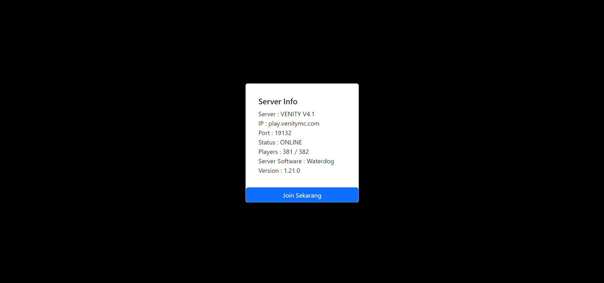

# TENTANG REPOSITORY INI

Repository ini berisi tentang website yang dapat menampilkan status server Minecraft itu aktif atau tidak dengan menggunakan API [Minecraft Server Status](https://mcsrvstat.us/)



# FITUR-FITUR
- Dapat menampilkan informasi server kamu seperti IP, Port, Nama Server, Versi, dll
- Jika server offline maka akan ditampikan pada card
- Loading :v
- Pakai Bootstrap :V
- Tombol direct ke Minecraft langsung (Jadi user bisa join server tanpa masukin IP dan Port)

# Cara Menggunakan dan Menjalankan Website

1. Clone repository ini (Bisa download manual atau pakai git bash/terminal)
2. Buka folder yang berisi repository ini
3. Buka file `server.js` dan ubah kode ini `https://api.mcsrvstat.us/bedrock/3/<IP dan Port Server kamu>` (Untuk Bedrock) dan ` https://api.mcsrvstat.us/3/<IP dan Port Server kamu>` (Untuk Java) pada variabel `const response`.

```js
// Panggil API Minecraft
const response = await fetch(
  `https://api.mcsrvstat.us/bedrock/3/<IP dan Port Server kamu>`
);
// Uraikan respon JSON jadi objek javascript yang bisa kamu gunakan
const data = await response.json();
```
Selengkapnya cek [disini](https://api.mcsrvstat.us/)

4. Ubah kode pada card yang berisi informasi server dengan mengurai respon JSON jadi objek javascript (kalo ngerti :v). Kamu bisa edit pada block program jika server online maupun offline

```js
if (data.online) {
        // Jika Server Online
        document.getElementById("server-status").innerHTML = `
                    <div class="card-body">
                        <h5 class="card-title">Server Info</h5>
                        <p class="card-text">
                        Server : ${data.motd.clean}<br>
                        IP : ${data.hostname}<br>
                        Port : ${data.port}<br>
                        Status : ONLINE<br>
                        Players : ${data.players.online} / ${data.players.max}<br>
                        Server Software : ${data.software}<br>
                        Version : ${data.version}<br>
                        </p>
                    </div>`;
    } else {
        // Jika Server Offline
        document.getElementById("server-status").innerHTML = `
                    <div class="card-body">
                        <h5 class="card-title">Server Info</h5>
                        <p class="card-text">
                        Server : ${data.motd.clean}<br>
                        Status : OFFLINE<br>
                        Server Software : ${data.software}<br>
                        Version : ${data.version}<br>
                        </p>
                    </div>`;
    }
```

5. Pergi ke `index.html` dan ubah tag dibawah ini
```html
<!-- Tombol Redirect ke Minecraft -->
<a href="minecraft:?addExternalServer=ServerTest|namaserver.com:port" class="btn btn-primary">Join Sekarang</a>
```
**Keterangan :**
- `ServerTest` : Nama yang akan diberikan pada server di daftar server Minecraft Bedrock/Java (Jangan lupa ganti sama nama server kamu)
- `namaserver.com` : Alamat server Minecraft (Jangan lupa diganti sama IP Server kamu).
- `port` : Port yang digunakan server Minecraft (Jangan lupa diganti sama Port kamu).

6. Jangan lupa uji coba dan pastikan website ini berhasil
7. Jika sudah berhasil dan aman, kamu bisa deploy website ini ke tempat kamu hosting website kamu sendiri

# Website
Website ini dibangun dengan menggunakan :
- [Bootstrap](https://getbootstrap.com/) - Bootstrap adalah framework front-end yang populer untuk pengembangan web yang menyediakan template desain berbasis HTML, CSS, dan JavaScript untuk membangun antarmuka pengguna yang responsif dan modern.
- [Minecraft Server Status](https://mcsrvstat.us/) - Website yang memungkinkan kamu mendapatkan informasi tentang server Minecraft dengan cepat dan menyediakan API untuk digunakan pada website ini
- [Chrome](https://www.google.com/intl/id/chrome/) - Chrome adalah peramban web (web browser) yang dikembangkan oleh perusahaan teknologi terkemuka, yaitu Google.

# Creator
- [AhZanMC](https://bio-link.ahzanmc.my.id/)

# Thanks
Makasih lohhh yang udah menggunakan repositori untuk keperluan website server kalian, kalian boleh memodifikasi sesuai kebutuhan kalian :)